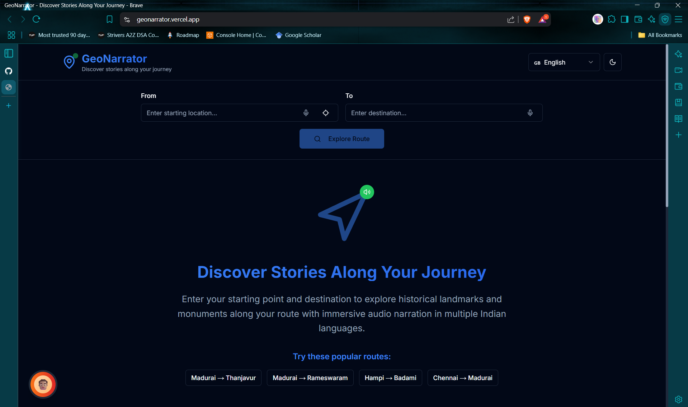
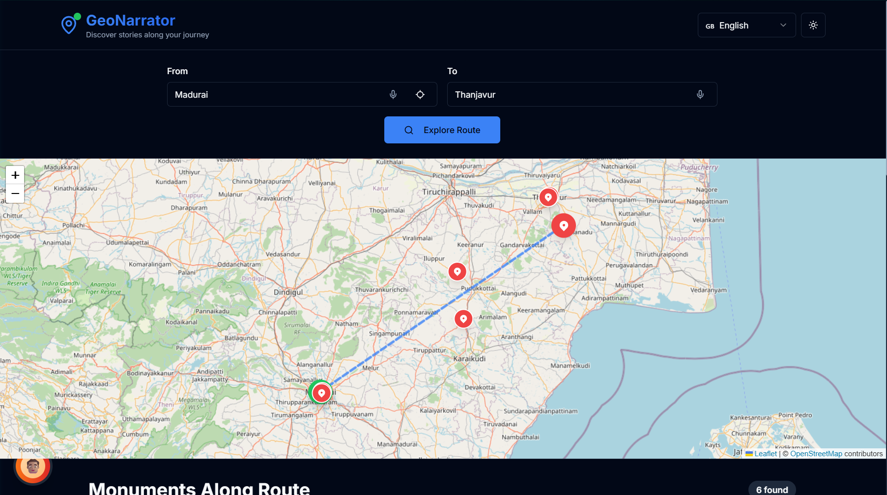
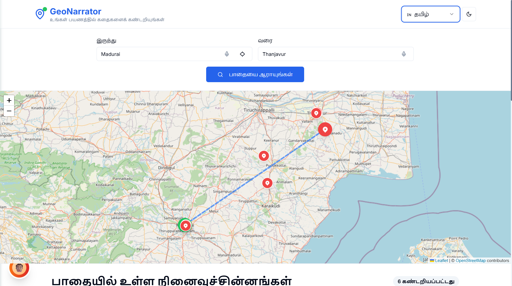
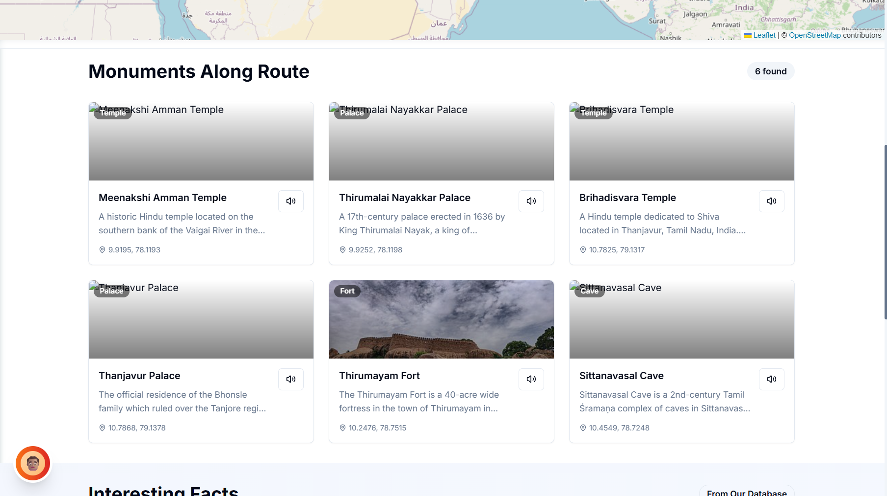
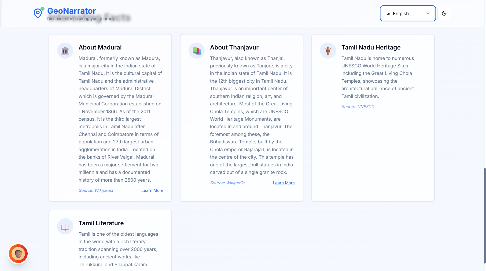

# Call2Code_VAura

# 🌍 GeoNarrator – Turn Your Route into a Story

> 🚗 A smart travel companion that narrates interesting facts and stories about the places you pass using Google Maps and Wikipedia APIs.

---

## Problem Statement - 

**API Remix**

---

## 🧠 What is GeoNarrator?

**GeoNarrator** transforms everyday travel into a meaningful learning experience. By analyzing your route and combining it with publicly available data from Wikipedia, the app narrates short and fascinating facts about historical landmarks, cultural sites, and notable places along the way.

Whether you're a tourist, commuter, student, or adventurer — GeoNarrator makes your journey informative and engaging, without interrupting your navigation.

---

## ✅ Features Implemented

- 📍 **Route Visualization**
  - User inputs origin and destination.
  - “Use My Location” option for automatic geolocation.
  - Route displayed interactively using OpenRouteService and Leaflet map.

- 🗺️ **Landmark Discovery**
  - Landmarks, monuments, and attractions fetched every ~20 km along the route.
  - Uses **Overpass API** (OpenStreetMap) to find nearby POIs.
  - Landmarks shown in card layout with title, distance, and details.

- 📚 **Contextual Narration**
  - Wikipedia summary fetched for each landmark.
  - Text-to-speech (TTS) narration support for landmark and historical facts. (Level - Hard)

- ➕ **Add to Route**
  - Option to insert selected landmarks into the journey path.
  - Visually updates route with new stops.

- 🧠 **Regional Historical Facts**
  - Reverse geocoding using **Nominatim** to extract place names.
  - Wikipedia summary fetched for both origin and destination regions.
  - Displayed as historical/cultural context under "Facts" section.

- 🌗 **Theme and Language Switching**
  - Toggle between light and dark themes. (Level - Easy)
  - Dropdown for switching interface language. (Level - Medium)

- 💡 **Responsive & Intuitive UI**
  - Route on left, landmarks and facts on right.
  - Interactive, mobile-friendly design with clean layout.
 
---

## 🔧 How It Works

1. **User inputs the origin and destination** on the homepage. A “Use My Location” button is also available to autofill the start point using browser geolocation.
2. The backend uses **OpenRouteService (ORS) API** to fetch the driving route and generate a polyline with intermediate coordinates.
3. Every ~20 km along the route, the app samples points and sends those to the **Overpass API (OpenStreetMap)** to fetch nearby **landmarks, monuments, and historic sites** within a 20 km radius.
4. For each point of interest (POI), the app fetches a **Wikipedia summary** using the **Wikipedia Summary API**, giving users a concise description of each location.
5. Additionally, the app reverse-geocodes the start and end points using **Nominatim (OpenStreetMap)** to extract the place names, and retrieves brief historical facts or context using **Wikipedia**.
6. The frontend displays:
   - An interactive map with the route and user-added landmark stops.
   - Landmark cards with title, summary, distance from route, and a **speaker icon** for text-to-speech narration.
   - A **“Facts” section** showing historical notes about the start/end regions.
7. Users can click **“Add to Map”** to insert interesting landmarks as custom stops on their route.

---

## 🌐 APIs Used

1. **OpenRouteService (ORS) API**
   - Used for route calculation between start and destination points.
   - Returns detailed coordinates (polyline) of the travel path.
   - [Documentation](https://openrouteservice.org/dev/#/)

2. **Overpass API (OpenStreetMap)**
   - Used to query geographical points of interest (POIs) such as historic sites and tourist attractions within a 20 km radius of the route.
   - [Documentation](https://wiki.openstreetmap.org/wiki/Overpass_API)

3. **Wikipedia REST API**
   - Fetches short summaries (intro paragraphs) of known landmarks and historical facts based on location titles.
   - [Documentation](https://en.wikipedia.org/api/rest_v1/)

4. **Nominatim (OpenStreetMap Reverse Geocoding API)**
   - Converts coordinates (latitude and longitude) into human-readable location names (e.g., city, town).
   - Used to extract meaningful place names for fetching facts.
   - [Documentation](https://nominatim.org/release-docs/latest/api/Reverse/)

---

## Output Images











---

## ⚙️ Backend Setup & Testing

1. **Clone the Repository**
   ```bash
   git clone https://github.com/your-username/GeoNarrator.git
   cd GeoNarrator/Backend
2. **Install the NPM Packages**
   ```bash
   npm install
3. **Add .env File**
   ```bash
   ORS_API_KEY = "eyJvcmciOiI1YjNjZTM1OTc4NTExMTAwMDFjZjYyNDgiLCJpZCI6ImNmNzA3M2VkODVlNjQzYWE5ZWUwZTEyOTU1OTk5YjUyIiwiaCI6Im11cm11cjY0In0="
4. **Run the Server**
   ```bash
   node app.js

## ⚙️ Frontend Setup & Testing
1. **Install the NPM Packages**
   ```bash
   npm install
2. **Run the Server**
   ```bash
   npm run build
---
